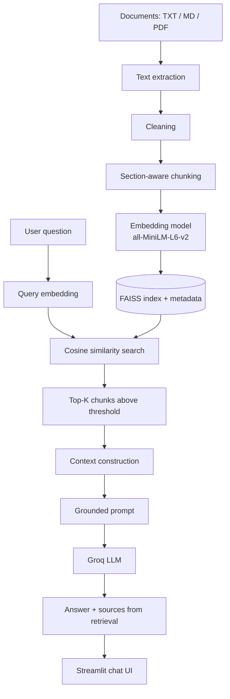

# AI Knowledge Base RAG

A Retrieval-Augmented Generation (RAG) system built from scratch in plain Python (no LangChain or LlamaIndex) to show how each stage of the pipeline works. It answers questions about a knowledge base and user-uploaded documents, and shows the exact sources used.

## Overview

The system retrieves the most relevant text chunks from a FAISS vector index and passes them to a Groq-hosted LLM, which is instructed to answer only from that context. The demo knowledge base is a fictional university (Northfield Institute of Technology), so the facts cannot be answered from the LLM's general knowledge. If an answer appears, retrieval worked.

## Architecture



## How It Works

1. **Ingestion:** files are read, cleaned, split into overlapping chunks (500 characters, 100 overlap) along section boundaries, and each chunk is prefixed with `[Document > Section]`.
2. **Embedding:** each chunk becomes a 384-dimensional normalized vector.
3. **Indexing:** vectors go into a FAISS `IndexFlatIP`. On normalized vectors, inner product equals cosine similarity.
4. **Retrieval:** the question is embedded with the same model, and the top-K most similar chunks above a threshold are returned.
5. **Generation:** the chunks are numbered and put in the prompt. The LLM must answer only from them and cite `[Source N]`.
6. **Attribution:** source file names are taken from retrieval metadata, never from LLM output.
7. **Out-of-scope handling:** if no chunk passes the threshold, the LLM is not called and the app says the information is unavailable.

## Tech Stack

Python, Streamlit, Sentence-Transformers (`all-MiniLM-L6-v2`), FAISS (CPU), Groq API, pypdf.

## Features

- Chat interface with source citations
- Similarity scores and expandable retrieved chunks
- Adjustable Top K and relevance threshold
- Upload TXT, MD and PDF files (per-session, duplicates detected by hash)
- Error handling for missing or invalid API key, rate limits, empty or unreadable files, and empty queries
- Swappable LLM and embedding model through environment variables

## Installation

```bash
git clone https://github.com/<you>/rag-system.git
cd rag-system
python -m venv .venv && source .venv/bin/activate
pip install -r requirements.txt
```

## Environment Setup

```bash
cp .env.example .env
```
Set `GROQ_API_KEY` (from console.groq.com/keys) and `GROQ_MODEL` (from console.groq.com/docs/models). Never commit `.env`. On Streamlit Cloud, add the same values under **Settings > Secrets**.

## Running the Application

```bash
streamlit run app.py
```

## Example Questions

- What GPA is needed for the AI internship?
- Which semester is Deep Learning taken in, and what is its prerequisite?
- What GPA do I need for the Honors Thesis?
- How is the capstone graded?
- Out of scope (should be refused): What is the tuition fee at NIT?

## Evaluation

Developed and tested step by step in Google Colab. Retrieval was evaluated on 14 hand-labelled questions with Precision@K, Recall@K, Hit Rate and MRR, at document level.

| Chunking | Hit Rate@4 | Recall@4 | Precision@4 | MRR |
|---|---|---|---|---|
| Fixed-size | _fill in_ | _fill in_ | _fill in_ | _fill in_ |
| Section-aware | _fill in_ | _fill in_ | _fill in_ | _fill in_ |

**A retrieval bug found by manual review:** with fixed-size chunks, "How is the capstone graded?" was wrongly refused. The chunk containing the grading percentages was ranked below Top-K because it was separated from the word "capstone". The refusal was correct given the context the LLM received, so the fault was in retrieval. Section-aware chunking with heading prefixes addressed this. _Add your measured before/after result._

## Limitations

- The evaluation set is small (14 questions) and measured at document level, which can hide missed chunks.
- Pure vector search can miss exact keyword matches.
- The relevance threshold is a crude out-of-scope filter. Prompting reduces hallucination but does not eliminate it.
- Citations show what was retrieved, not proof that the model used it.
- Scanned PDFs are not supported (no OCR).
- Uploaded documents are untrusted input and could contain prompt-injection text. The prompt tells the model to ignore instructions in the context, which is a mitigation, not a guarantee.
- Uploads live only in the current browser session. The built-in index is rebuilt on each start.
- There is no conversation memory. Each question is answered independently.

## Future Improvements

- **Intermediate:** hybrid BM25 + vector search, cross-encoder reranking, metadata filtering, streaming responses, conversation memory with query rewriting, a larger chunk-level evaluation set.
- **Advanced:** RAGAS or LLM-as-judge evaluation, ChromaDB or pgvector, caching, authentication, document versioning, multi-query retrieval.

## Project Structure

```
app.py               Streamlit UI
rag.py               Pipeline: ingest, retrieve, prompt, generate
embeddings.py        Embedding model wrapper
vector_store.py      FAISS index + metadata
document_loader.py   TXT/MD/PDF extraction
text_processing.py   Cleaning and chunking
errors.py            User-safe exception type
data/knowledge_base/ Demo documents
```